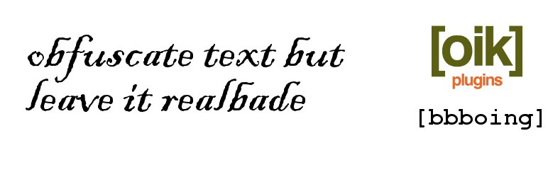

# bbboing 

* Contributors: bobbingwide, vsgloik
* Donate link: https://www.oik-plugins.com/oik/oik-donate/
* Tags: shortcode, obfuscate
* Requires at least: 3.9
* Tested up to: 6.8.2
* Stable tag: 1.8.7
* License: GPLv2 or later
* License URI: http://www.gnu.org/licenses/gpl-2.0.html
* Gutenberg compatible: Yes

obfuscate text but leave it readable, apparently

## Description 
Aoccdrnig to a rscheearch at Cmabrigde Uinervtisy, it deosn't mttaer in waht oredr the ltteers in a wrod are, the olny iprmoetnt tihng is taht the frist and lsat ltteer be at the rghit pclae.
The rset can be a toatl mses and you can sitll raed it wouthit porbelm.
Tihs is bcuseae the huamn mnid deos not raed ervey lteter by istlef but the wrod as a wlohe.

This plugin implements a version of an algorithm that will produce text similar to the above.
Basically it changes each word by randomising the order of the letters, leaving the first and last letter of each word the same.

You implement this on your website using the [bbboing] shortcode.

The syntax is:

[bbboing
  text="seed|text - some text to obfuscate"
  form="N|Y - display form to allow changes"
  both="N|Y - display both original and output text"]

If you don't specify any parameters you get a 'bbboing'ed version of the original text.

Examples:
 [bbboing text="code is poetry"] may produce 'code is peroty' or 'cdoe is pretoy'
 [bbboing text='powered by WordPress'] may produce 'prweoed by WrdsorPes'

It's also feasible that the randomisation produces exactly the same output as input.
So [bbboing text='bobbing wide'] may produce 'bobbing wide'

Of course, nothing happens for words with fewer than 4 letters so
[bbboing text='it is not a con'] WILL produce the same output as input.

You may notice that some spammers/spambots intentionally misspell words when creating comments.
bbboing does not in anyway endorse this.

Please use bbboing for your own amusement.

* Note: the bbboing plugin is dependent upon the oik plugin.

## Frequently Asked Questions 

# Installation 
1. Upload the contents of the bbboing plugin to the `/wp-content/plugins/bbboing' directory
1. Activate the bbboing plugin through the 'Plugins' menu in WordPress
1. Whenever you want to produce some 'bbboing'ed text use the [bbboing] shortcode.

* Note: bbboing is dependent upon the oik plugin. You can activate it but it will not work unless oik is also activated.

# Where does bbboing come from? 
bbboing is an anagram of bobbing, which is part of my company name ( bobbing wide - hence my WordPress.org username ).
Furthermore it's an anagram where the first and last letters of the word are not changed.
'bbboing' is just one of the possible results of running the algorithm against 'bobbing'.

# What does obfuscate mean? 
Render obscure, unclear, or unintelligible. Bewilder (someone).

# What is this plugin for? 
The purpose of this plugin is to be entertaining, educational and experimental.

Entertaining in that it produces an obfuscated version of some text following the "rules" defined in https://www.mrc-cbu.cam.ac.uk/people/matt.davis/Cmabrigde/

Educational in that it shows an example of a plugin developed using the oik application programming interface, implementing lazy smart shortcodes.
* smart - the shortcodes understand the content in which they're invoked
* lazy - the code to evaluate the shortcode is loaded on demand, when the shortcode is used.

* Experimental: some very similar code is being used to automatically generate language files for a locale identified as bb_BB.

# Can you tell me more about the research? 
See https://www.mrc-cbu.cam.ac.uk/people/matt.davis/Cmabrigde/

See also the definition of typoglycemia, where the original text is longer than the example used here.
[typoglycemia](https://en.wikipedia.org/wiki/Typoglycemia)

# Further reading 
If you want to read more about oik plugins and themes then please visit [oik-plugins](https://www.oik-plugins.com)

## Screenshots 
1. Example of [bbboing form=y cols=80 text="some text"]

## Upgrade Notice 
# 1.8.7 
Tested with WordPress 6.8.2, PHPUnit 10 & 11

# 1.8.6 
Update for support for PHP 8.4

# 1.8.6 
Update for support for PHP 8.3

# 1.8.5 
Update for support for PHP 8.1 and PHP 8.2

# 1.8.4 
Tested with WordPress 5.3.2 and WordPress Multi Site, PHP 7.3 and 7.4, PHPUnit 8

# 1.8.3 
7th Anniversary edition. Tested with WordPress 4.7.4 and PHP 7.1.

# 1.8.2 
Created French and bbboing language versions. Tested with WordPress 4.6.

# 1.8.1 
Tested with WordPress 4.5 and WordPress MultiSite. Now depends on oik v3.0.0 or higher

# 1.8.0 
Tested with WordPress 4.4 and WordPress MultiSite. Now depends on oik v2.5

# 1.8 
To test integration with the shortcake UI plugin you also need oik v2.5-alpha.0130 or higher.

# 1.7 
Now dependent upon oik v2.2 or higher. Tested with WordPress 4.0

# 1.6 
Now dependent upon oik v2.1 or higher. Tested with WordPress 3.9

# 1.5 
Required for smart-bbboing

# 1.4 
Now dependent upon oik v2.1-alpha.1028 or higher

# 1.3.0730 
Requires oik version 1.12 or higher

## Changelog 
# 1.8.7 
* Changed: Support PHP 8.4 #6
* Tested: With WordPress 6.8.2 and WordPress Multisite
* Tested: With PHP 8.3 & PHP 8.4
* Tested: With PHPUnit 9.6, 10.5 and 11.4

# 1.8.6 
* Fixed: Only respond to oik_add_shortcodes after oik_loaded has been run,https://github.com/bobbingwide/bbboing/issues/5
* Changed: Support PHP 8.3,https://github.com/bobbingwide/bbboing/issues/5
* Tested: With WordPress 6.6.1 and WordPress Multisite
* Tested: With PHP 8.3
* Tested: With PHPUnit 9.6

# 1.8.5 
* Changed: Support PHP 8.1 and PHP 8.2,https://github.com/bobbingwide/bbboing/issues/5
* Tested: With WordPress 6.4.1 and WordPress Multisite
* Tested: With PHP 8.1 and PHP 8.2
* Tested: With PHPUnit 9.6

# 1.8.4 
* Changed: Update tests for PHPUnit 8,https://github.com/bobbingwide/bbboing/issues/4
* Tested: With WordPress 5.3.2 and WordPress Multi Site
* Tested: With PHP 7.3 and PHP 7.4
* Tested: With PHPUnit 8

# 1.8.3 
* Added: Notes for 7th anniversary edition.
* Tested: With WordPress 4.7.4 and WordPress Multisite
* Tested: With PHP 7.1

# 1.8.2 
* Changed: Created French version to test with WordPress 4.6
* Changed: Created bb_BB locale version to test with WordPress 4.6
* Changed: Added PHPUnit tests in the GitHub version https://github.com/bobbingwide/bbboing/issues/2
* Fixed: wp_nonce_field() called with incorrect parameters https://github.com/bobbingwide/bbboing/issues/1

# 1.8.1 
* Tested: With  WordPress 4.5 and WordPress MultiSite.
* Changed: Now depends on oik v3.0.0 or higher.
* Changed: Improved some code and docblocks to WordPress standards

# 1.8.0 
* Tested: With WordPress 4.4 and WordPress MultiSite.
* Changed: Updated oik-activation to match oik.
* Changed: Now depends on oik v2.5 or higher.

# 1.8 
* Changed: Syntax help changed to test integration with the shortcake UI plugin

# 1.7 
* Changed: Responds to "oik_add_shortcodes"

# 1.6 
* Changed: Added readme.md file for GitHub version. Built from readme.txt

# 1.5 
* Changed: Now invokes "bbboing_loaded" action during "init". This allows smart-bbboing to get going before oik is loaded.

# 1.4 
* Changed: The "bbboing" algorithm now ignores punctuation and complicated stuff
* Changed: Added nonce to the form. Sanitizes content.
* Changed: Restructured plugin to follow oik plugin style.
* Tested: with oik-css activated. Note: oik-css alters the sequence in which content is filtered, deferring wpautop() processing until after shortcode expansion.
* Tested: with WordPress 3.7.1

# 1.3.0730 
* Added: code to produce warnings when the pre-requisite version of oik is not activated
* Changed: bbboing is now dependent upon oik version 1.12 or higher
* Changed: bobbing is now dependent upon oik and bbboing
* Fixed: bobbing issued a fatal error if oik was not activated. Function bw_backtrace() was missing.

# 1.0 
* Initial version on wordpress.org. Works with oik version 1.11

# 0.0 
* Prototyped bbboing.inc on or before 17th April 2010
